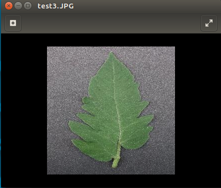

# A simple REST API for detecting diseases in Plants

## Model: Google Inception 2.0 (Pre-trained model fine tuned)

## Method: 

- Read camera feed
- Extract frame and store temporarily

- Send frame to REST API server

- Server processed image and inputs to Tensorflow Model

- Tensorflow Model provides predicted classification

- The plant state is then set to the classification

### Screenshot

